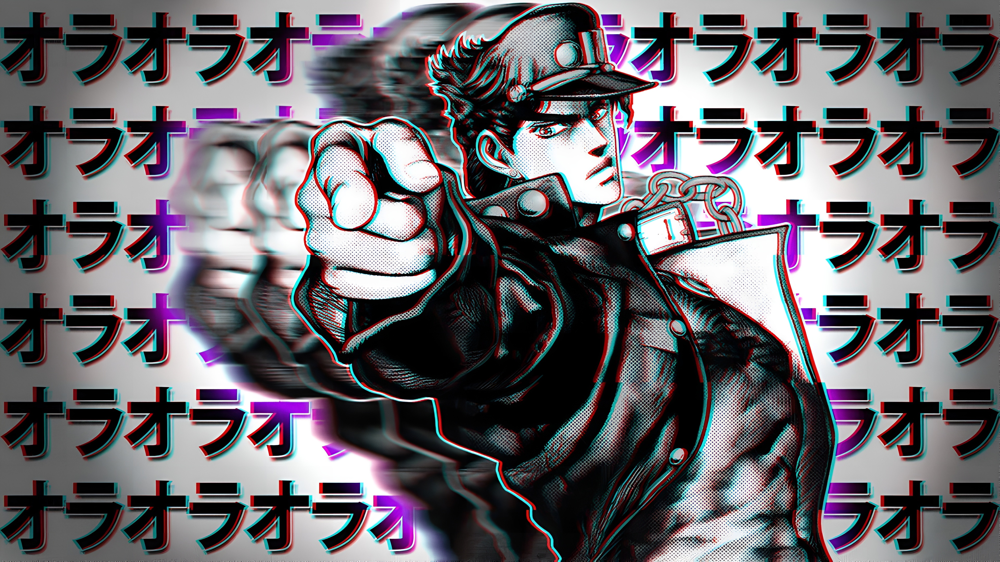

<div align="center">




</div>

<br>

```python
class Carlos:
    role      = "Python Developer"
    focus     = ["Python", "Linux", "Cybersecurity"]
    interest  = ["FastAPI", "Pentest", "Redes"]
    os        = "Linux # obviously"
    status    = "learning by breaking things"
```

<br>

<div align="center">

`git log --author="Carlos" --oneline` — um dev iniciante que trata cada erro como uma aula.

</div>

---

## `> interests.log`

```
[*] Python      — scripts, automação e lógica que resolve problemas reais
[*] POO         — modelando o mundo com código limpo e estruturado
[*] Linux       — terminal acima de tudo, sempre
[*] Redes       — entender como os dados se movem antes de tentar quebrá-los
[*] Pentest     — encontrar a falha antes que alguém mal-intencionado encontre
[*] FastAPI     — próximo na fila, REST do jeito certo
```

---

<div align="center">


<br>


&nbsp;&nbsp;

&nbsp;&nbsp;

&nbsp;&nbsp;

&nbsp;&nbsp;

&nbsp;&nbsp;


</div>

---

## `> stats --fetch`

<p align="center">
  
  
</p>

<p align="center">
  
</p>

---

## `> contribution.snake`

<p align="center">
  
</p>

---

<div align="center">


**`$ echo "cada linha de código é um passo. cada bug, uma aula."`**

</div>
